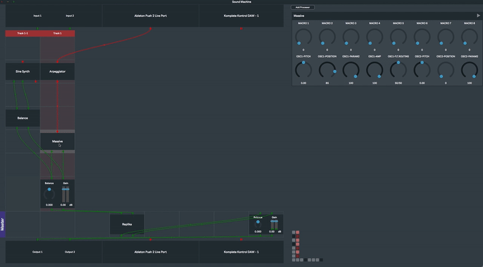

# FlowGrid

**This project is outdated, and is in fact no longer functional. I'm working on a new version of this project [here](https://github.com/khiner/flowgrid).**

Inspired by [Tim Exile's Flow Machine](https://youtu.be/SLguU77xuQA), I'm aiming to build something that:

* is a fun jam box for the Push 2 and a Mac
* acts as a central routing and processing interface to external gear (MIDI, audio, CV etc)
* provides a hierarchical grid-based playing interface
  - _(Note: The hierarchical part is not happening with this iteration - only one grid level here.)_

## What is this?

This is a standalone desktop music production application written in C++ using the JUCE framework.
It can run on any modern Mac, and it is designed to be used with Ableton's _Push 2_ hardware, although it can be used with a plain old mouse and keyboard as well.

FlowGrid is a modular patching environment and plugin host.
It allows for arbitrary connections between internal processors and 3rd party plugins, as well as external audio and MIDI IO.
Unlike other modular music software tools, however, it is _opinionated_.
By default it behaves similar to a DAW, like Ableton, with separate tracks that each have sound producers and effects connected in series, each with a mixer channel that connects to a master track.
This means it can feel a lot like using a traditional DAW - adding tracks and adding devices to tracks, adjusting mixer levels etc..
_Unlike_ traditional DAWs, all the default connections are visible and alterable, and you can connect things however you want.
(For a complete description of how default and custom connections behave, see [Default and Custom Connections](#default-and-custom-connections).)

Every aspect of the design of this application has hardware control in mind, and specifically for deep integration with Ableton's Push 2.
Processors are arranged in an 8X8 grid to be selected, moved, connected and controlled via the 64-pad grid of the Push 2.

## Why?

I've made music off and on as a hobby for most of my life.
A few years ago I started getting into modular synthesis, and I fell in love with the immediacy and surprise of it.
More and more, I started thinking about and working with music as an _active_ and _improvisational_ creative process, and became less interested in the editing, arranging, mixing and mastering aspects of producing full, polished tracks.

I also became really inspired and actually pretty blown away by [Tim Exile's Flow Machine](https://youtu.be/hQbg-uHwcig)
I like the immediacy of being able to just sing and play and start capturing, looping and manipulating audio from the outside world into manglers in the digital world as quickly as possible.

In addition to wanting a jambox like Tim Exile has going on, I'm very interested in the idea of making what you might call an "intelligent" music instrument.
One where I could, say, hum a tune, and it would translate it to MIDI and maybe even know what instrument I wanted.
Or beatbox and it would classify the sounds and make a beat with similar sounds from my sample library.
Or generate melodies based on music in my library to play along with me.

What I really want is something that:

* is flexible, immediate, quick and fun
* allows me to learn more about audio & DSP and quickly turn ideas into something I can play with and integrate, with minimal boilerplate and overhead
* can process, mangle and loop audio and MIDI from the real world
* integrates with other plugins and external hardware that I already use
* allows for meta-creation, e.g. instruments that create other instruments or drum machines that choose their own samples

These are pretty big goals and there's a long way to go, but this app is starting to feel like a stable foundation to iterate towards them bit by bit!

# Guide

## Saving/loading projects

Projects can be created, saved and loaded from the `File` menu.
The most recently loaded project will load by default.
Recently opened projects can be selected directly from the `File` menu.
Projects are saved with a `.smp` in a folder of your choosing, which will be remembered for futures saves/loads.

## Undo/redo

Every action is undoable, from creating tracks and processors to creating and moving connections, changing parameters or changing the enabled external IO device or channels.

You can undo and redo by:
* selecting Undo or Redo from the `Edit` menu
* using `ctrl+z` or `shift+ctrl+z` hotkeys
* using the Ableton Push 2 'Undo' or `shift+'Undo'` buttons

## Tracks

Tracks in FlowGrid are simply lanes of processors.
Tracks are arranged vertically and at most 8 tracks are in view at any time, but an unlimited number can be created (see [Selection and navigation](#selection-and-navigation)).

Each vertical track has an unlimited number of processors, but only 7 visible visible at any time, including one special processor slot that is reserved for an optional Mixer Channel processor.

The last processor in each track routes by default to the first effect processor in the 'Master' track.

### Adding and removing tracks

A track can be created by:
* selecting 'Insert track' from the `Edit` menu, or by using the `ctrl+t` hotkey,
  - This will create a track _with a Mixer Channel_, and insert it to the right of any currently selected track.
* selecting 'Insert track (without mixer)' from the `Edit` menu, or using the `shift+ctrl+t` hotkey,
  - This will create a track _without a Mixer Channel_, and insert it to the left of any currently selected track.
    It will be named based on the selected track and can be thought of as a kind of _subtrack_.
    (This is useful for connecting more generators or effects with a single mixer channel, or for connecting directly to the master track or external outs.)
* or adding a generator-type processor to a track that already has a generator.
  - This will automatically create a new track without a mixer channel, and route the new generator to the first effect processor in the selected track.
    This is useful for, say, doubling a synth voice.

Remove a track by selecting its label (or navigating to it with arrow keys or the Push 2 arrow buttons), and hitting `delete`, or the `'Delete'` button on the Push 2.

The Master track can be deleted.
Without the master track present, the last processor of each track will connect by default to the external audio/MIDI output device.

If the Master track has been deleted, a new Master track can be created via the 'Create master track' option under the `Create` menu, or with a `shift+ctrl+m` shortcut.
At most one master track can exist at any time.

### Modifying tracks

A track's name can be changed by left-clicking its label, and its color can be changed by right-clicking its label.

Move a track to a different position by clicking and dragging on its label.

## Processors

_Processors_ are sound and MIDI generators, effects, synths - anything that creates or modifies sound or MIDI!
Processors include both _internal_ processors and _external_ plugins.
Internal processors are actually implemented as plugins.

The automatable parameters of any internal processor or external plugin will be shown natively in the processor editor to the right of the processor graph when it is selected.
All parameters can be changed directly in this editor, or via the Push 2 encoder knobs above the editor shown in the Push 2 display.

To show the native plugin GUI of an external plugin, either double-click on its node in the graph editor, or right-click and select 'Show plugin GUI'.

All processor/plugin parameter changes are undoable.
(Even edits done in a native external plugin editor are undoable, as long as the developers marked it as automatable!)

The full state of all processors and plugins are saved with the project.

### Adding and removing processors

Add a processor by:
* right-clicking in an empty slot in the graph editor and selecting from the browse menu,
* using the 'Add processor' button at the top-right of the app window,
* or hitting the Push 2 `'Add device'` button and using the Push 2 arrows and buttons to select a processor from the browser in the Push 2 display

New processors are created with default connections already made.
(See [Default and custom connections](#default-and-custom-connections).)

### External audio and MIDI IO

Audio and MIDI device settings can be changed by selecting 'Change the audio device settings' under the `Options` menu.
Enabled channels and MIDI devices are saved globally as application properties, and locally with each project.
This means the most recent settings will be remembered for future projects, but a project will always be loaded with the settings it was saved with (if the saved devices are connected).

Audio and MIDI devices can be disconnected and reconnected while the app is running.
Their enablement is remembered and they will automatically have corresponding IO processors added or removed as needed.

Changing the selected audio input/output device is an _undoable action_.

#### Audio IO

All available audio channels from the selected soundcard are made available as connector pins on automatically created IO processors above and below the processor graph editor.
The channel names from the connected device, if available, are displayed above (or below) their connector pins.
Enabling or disabling an audio IO channel is an _undoable action_.
For example, undoing after disabling an audio input channel that had custom connections will re-enable that channel and restore those connections.

#### MIDI IO

All enabled MIDI input/output device connections are also available above and below the graph editor.
The device names are displayed in their automatically created processors.
Enabling or disabling a MIDI IO device in the audio/MIDI settings is an _undoable action_.

### Default and custom connections

FlowGrid is designed to connect processors to each other in an unsurprising way by default.
However, default connections can be disabled for any processor by right-clicking on its node in the graph editor and selecting 'Disable default connections', which will disconnect any default connections and prevent them from being made to or from that processor in the future.

When a processor is created, deleted, or moved, the default connections of the graph are updated to reflect the change.
When moving a processor, all connections will visually update in the graph editor to show you what the connection state will be after the move.
However, connections will only be finalized and take effect in the audio graph when the mouse is released.

If you would like to move a processor to a new position or track _without_ affecting any default connections, hold `alt` while moving the processor.
While `alt` is held, no default connections will be added or removed.
When you finalize the move by releasing the mouse, any default connections that wouldn't be considered default in the new position will be turned into _custom_ connections.

_Custom_ connections are audio or MIDI connections that you explicitly make between pins.
These connections are distinguished by a different color, and they will never be automatically destroyed after you create them.
Outgoing connections overrule default connections; once custom outgoing connections are made from a processor, any default outgoing connections will be removed, and no default outgoing connections will be created for that processor as long as any custom ones exist.

#### How are default connections determined?

Each processor that has outputs connects to _at most one_ audio processor and _at most one_ MIDI processor by default.
In general, default connections are made from _top to bottom_ and from _left to right_.
For example, a synth that has audio _and_ MIDI outs could connect by default to an audio effect processor below it in the same track, and to a MIDI effect below and to the right of it on a different track.
Or it could connect to a processor in the master track, or to an external audio or MIDI output processor.
Default connections can be "blocked" if the first processor below it in the same track does not accept inputs.

Although processors only connect their _outgoing_ audio or MIDI pins to _one_ effect processor (or external output) by default, they can _receive_ any number of default connections on their input pins.

Default connections from audio or MIDI _external inputs_ are changed based on the processor that is currently selected.
External audio and MIDI connections are each made at all times to _the top-right-most processor that has free inputs and is connected by any number of steps to the currently selected processor_.

### Moving processors

Move a processor to any cell by clicking and dragging it.
Mixer channels and IO processors are the only processors that cannot be moved.
As mentioned above, default connections are always updated when processors are moved (unless `shift` is being held), and finalized when the move is completed.

### Selection and navigation

Select a processor by clicking on its node in the graph editor.
Select a track by clicking on its label, or by clicking on any of its empty processor slots.
Selecting a track will also select its first processor.

Tracks and processors can also be selected via the Push 2, by using the buttons below or above the track/processor labels on the Push 2 display.

Press or hold arrow keys or the Push 2 arrow buttons to navigate the selection directionally.

At most a grid of 8X8 processors are shown.
Usually this will be a page of 8 tracks with 7 processors each, plus the master track with 8 processors along the bottom row.
If no master track exists, 8 processor slots will be shown for each track.

In the bottom-right of the application window, there is a context-pane showing which set of processors is currently being shown in the 8X8 grid.

### Plugins

When you first load FlowGrid, no external plugins will be loaded (as this can take a very long time if you have a lot of them!).
To make external plugins available, select 'Edit the list of available plugins' from the `Options` menu and select from the menu choices to load any available VST, VST3 or AU plugins on your system.
Once loaded, the application will remember your plugins and make them available for use (as described in [Adding/removing processors](#adding-and-removing-processors)).

The menu sort and ordering type can be changed via the 'Plugin menu type' item under the `Options` menu.
Processor-selection menus always have a top-level "Internal"/"External" choice, and each of these will use the selected sort/directory type.

The state of all external plugins is saved with the project.

### Internal processors

FlowGrid is currently lacking in the internal processor department, as the effort has been (and will continue to be for awhile!) on more fundamental aspects of application behavior.
This list will be updated as new processors become available.

* Mixer Channel
  - This is the only "special" processor type, other than audio & MIDI IO processors (which can't be explicitly added or removed except through changing audio IO settings).
    Each track can have _at most one_ Mixer Channel processor, and it can only be added to the last processor slot of the track.
    It has gain and balance parameters that are shown inside the processor node in the graph editor, along with a level meter.
    The Push 2 `'Mixer'` button shows a unified mixer view to control the gain and balance of all tracks that have Mixer Channels (very similar to Ableton's mixer view)

* Gain
  - A simple linear gain control

* Balance
  - A simple stereo balance control

* Sine Synth
  - A simple polyphonic synthesizer (with no parameters) that accepts and forwards MIDI input and uses simple sine-wave voices.

* Sine Bank
  - A toy processor that has four mixed sine waves, each with adjustable gain and frequency.

* Arpeggiator
  - A simple arpeggiator MIDI effect with a single rate parameter.

* Midi Keyboard
  - A MIDI generator processor that shows an onscreen keyboard window that can be controlled with a mouse or with a computer keyboard.

## Development

### Cloning the repository

Clone the repo (including the submodules for JUCE and libusb):

`git clone --recurse-submodules https://github.com/khiner/flowgrid.git`

### Building and running

This project uses CMake.
I use the CLion IDE to configure, build, run and debug the project.
If you're using CLion, everything should just work if you specify the root CMakeLists.txt file.
Theoretically though, it could be built and run using the CMake CLI as well.

### App settings files

Persistent application-specific settings, like scanned plugin info, and MIDI/audio IO device settings, are stored in `~/Library/Preferences/flowgrid.settings`. This file will be recreated with default settings if it is deleted.

OS-type app state, like the application window size and position, and the last opened project directory, is stored (on Macs) in the file `~/Library/Preferences/com.odandludo.flowgrid.plist`.

## License

This software is distributed under the [GPLv3 License](./LICENSE.txt).
